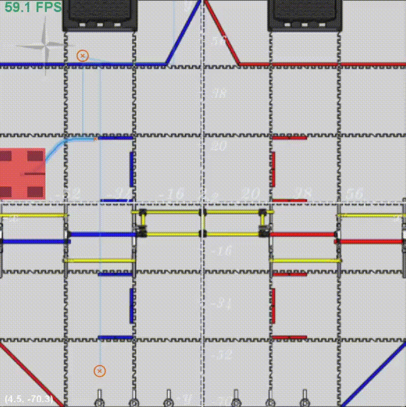
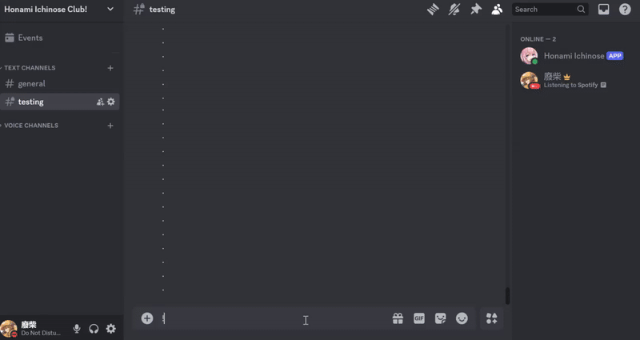
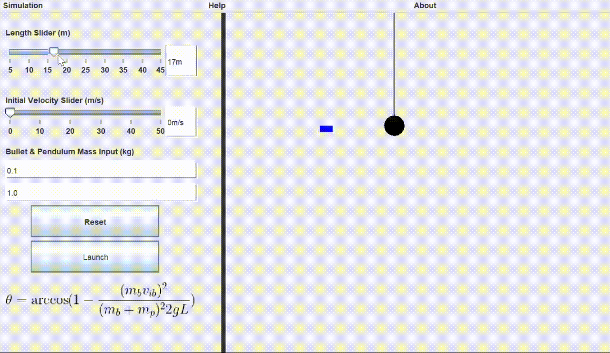

# Kaden Seto

Hi! I'm a first-year Engineering Science student at University of Toronto. I'm a creative programmer with a passion for exploring and creating in the diverse fields of programming, and I'm super passionate about machine learning and AI. I'm currently an Academic Developer in UofT's Machine Intelligence Team (UTMIST), [UofT's largest undergraduate machine learning team](https://utmist.gitlab.io/). Previously, I served as the Lead Programmer for my [high school's Robotics Team](https://titansrobotics.odoo.com/) and as a Backend Developer for my [high school's App Development Team](https://app.staugustinechs.ca/).

Some projects I've worked on :) 

  
  
  
  
  

