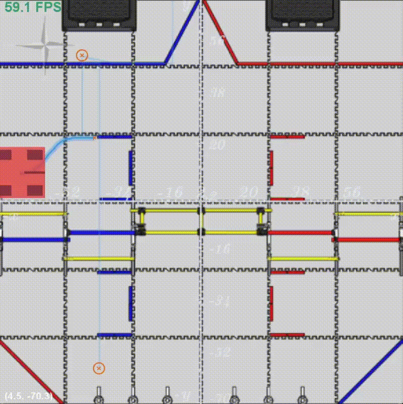

# Kaden Seto

I'm Kaden, a 2nd year [Engineering Science](https://engsci.utoronto.ca/program/what-is-engsci/), [Machine Intelligence](https://engsci.utoronto.ca/program/majors/machine-intelligence/) student at University of Toronto passionate about machine learning and AI, with a focus in reinforcement learning. 

Currently, I'm working at [Kinaxis](https://www.kinaxis.com/en) on the Risk Intelligence team as an **AI Software Engineer**, where I'm developing GenAI and software solutions for real-time detection and mitigation of external disruptions across supply chain management workflows. I'm also a **Founding ML Engineer** for a Stealth Startup, where I work on policy and behaviour optimization of AI agents in custom multi-agent RL environments.

Previously, I interned at **BMO** as a **Software Developer**, developing automation scripts that support and optimized efficiency of AWS service deployments for their AWS data warehousing initiative. 

In second year, I served as **VP Academics** in University of Toronto's Machine Intelligence Student Team (UTMIST), [UofT's largest undergraduate machine learning team](https://utmist.ca), where I led the organization of UTMIST's academic workshops, events, and programs. 

In first year, I was a **Reinforcement Learning Team Lead** in UTMIST, where I led the development of [UTMIST's first-ever tournament](https://utmist.ca/ai2), Canada's largest RL tournament (400+ participants), and subsequently produced a [technical paper](https://cucai.ca/2025_proceedings.pdf#page=28) which was submitted to CUCAI. I also led the **Application Review Committee** of [GenAI Genesis 2025](https://genaigenesis.ca/), Canada's largest AI hackathon.

In high school, I served as the **Lead Programmer** for my [high school's Robotics Team](https://titansrobotics.odoo.com/) and as a **Backend Developer** for my [high school's App Development Team](https://app.staugustinechs.ca/).

  
  
  
  
  
  

  
  

