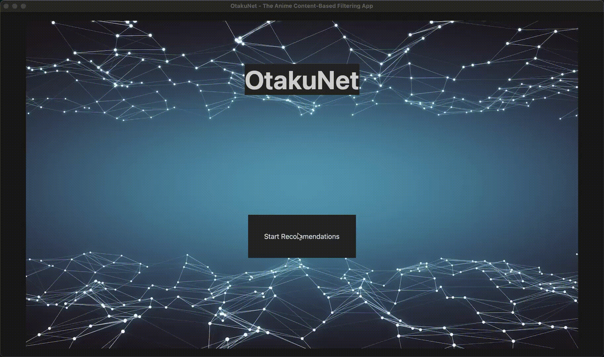

# Kaden Seto

Hi! I'm a first-year Engineering Science student at University of Toronto. I'm a creative programmer with a passion for exploring computer science & programming, and I'm super passionate about machine learning and AI. I'm currently a Reinforcement Learning Academic Lead Developer in UofT's Machine Intelligence Team (UTMIST), [UofT's largest undergraduate machine learning team](https://utmist.gitlab.io/), where I led a development team to develop [UTMIST's first-ever tournament](https://colab.research.google.com/drive/1V184vtHSagN13L0SbWGmnY-jCDvIefmm?usp=sharing) and subsequently produced a [technical paper](AI_Squared___CUCAI_2025_Paper_final.pdf), submitted to CUCAI & IEEE. Previously, I served as the Lead Programmer for my [high school's Robotics Team](https://titansrobotics.odoo.com/) and as a Backend Developer for my [high school's App Development Team](https://app.staugustinechs.ca/).

  
  
  
  
  
  

